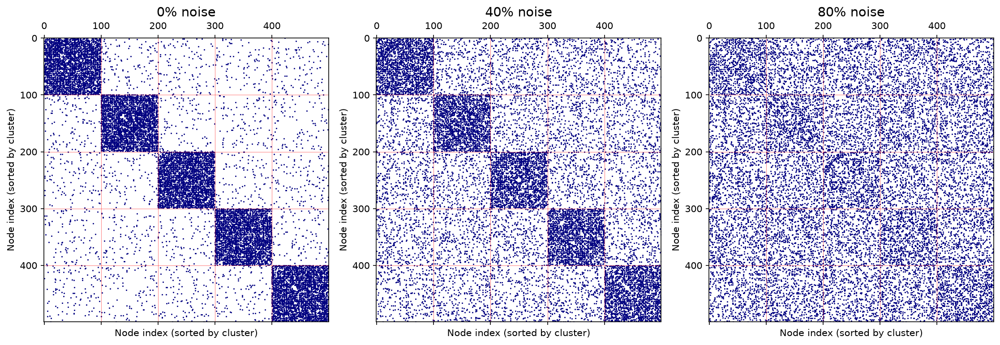
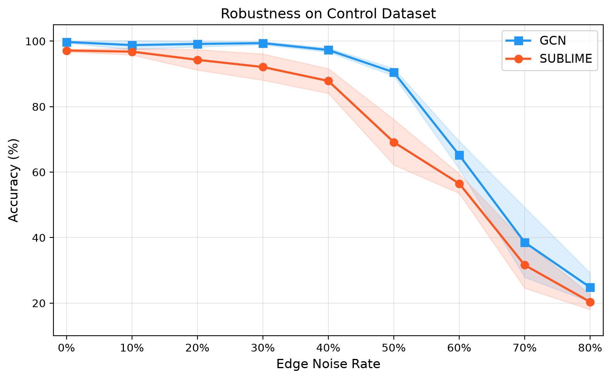

# Control Dataset: Testing Robustness to Structural Noise in Graph Structure Learning
Wishaal Kanhai (5679710)
**Course** -- DSAIT4205 Fundamental Research in Machine and Deep Learning
**Dataset generation code** -- https://github.com/wishaalk/DSAIT4205-Control-Dataset
*Delft University of Technology*

Another version of this blog can be found [here](https://hackmd.io/@uDrwE4LAQMGt8QvVKPvINQ/SktVVvNGMe).
## Motivation

Graph Neural Networks (GNNs) assume the input graph is meaningful, that edges represent real relationships between nodes. In practice, real-world graphs are noisy. Edges can be missing, spurious, or just wrong. A family of methods called **Graph Structure Learning (GSL)** tries to address this by learning a better graph from the data, rather than trusting the input graph as-is. Several recent GSL methods claim to be robust to noisy input structure:

- **SUBLIME** (Liu et al., WWW 2022): learns a refined graph in an unsupervised way via contrastive bootstrapping. [arXiv:2201.06367](https://arxiv.org/abs/2201.06367)
- **STABLE** (Li et al., NeurIPS 2022): refines structure by identifying "reliable" node representations and rebuilding edges from them. [arXiv:2207.09896](https://arxiv.org/abs/2207.09896)
- **NodeFormer** (Wu et al., NeurIPS 2022): sidesteps the input graph entirely, computing an implicit structure through all-pair attention. [arXiv:2207.08100](https://arxiv.org/abs/2207.08100)

These papers all evaluate on Cora, Citeseer, and Pubmed. These are real citation networks where nobody knows which edges *should* exist. You can measure downstream accuracy, but you cannot measure whether the method actually recovered the correct structure. There is no ground truth to compare against. This work introduces a synthetic dataset where there is.

## The Dataset
    
The goal is to have a graph with known community structure that can be systematically corrupted. To achieve this, a graph is generated using a **Stochastic Block Model (SBM)**: 500 nodes split equally into 5 clusters of 100. Within a cluster, any two nodes are connected with probability 0.3. Between clusters, that probability is only 0.01. The result is a graph with clear, ground-truth community labels.

Each node gets a 16-dimensional feature vector. Each cluster has a randomly generated centroid in feature space, and node features are sampled as that centroid plus Gaussian noise. The centroid scale is set to 0.5 and the noise standard deviation to 1.5. In practice this means the intra-cluster spread is about three times larger than the inter-cluster distance, so the clusters overlap heavily when looking at features alone. This is intentional: it forces methods to actually rely on the graph structure rather than solving the task from features alone.

The graph is then corrupted at increasing noise rates *r* (from 0% to 80%):
- Each true edge is removed with probability *r*
- The same number of random fake edges are added back

This produces 9 versions of the same graph with increasing corruption, while nodes, features, and labels stay identical.

| Property | Value |
|----------|-------|
| Nodes | 500 (5 x 100) |
| Features | 16-dim Gaussian |
| Classes | 5 |
| Clean edges | ~8,500 |
| Noise rates | 0%, 10%, 20%, ..., 80% |

### What Makes This a Control Dataset

1. **Known ground truth.** The graph was generated synthetically, so it is known exactly which edges are real and which are not.
2. **Single variable.** Only the noise rate changes between versions. Nodes, features, labels, and train/val/test splits are identical across all 9 graphs.
3. **Measurable structure recovery.** Precision and recall of any learned graph can be computed against the true adjacency, not just downstream classification accuracy.

### Visualizing the Corruption

The figure below shows how the adjacency matrix degrades as noise increases. At 0%, the block-diagonal structure is clearly visible. At 40%, the blocks are noticeably thinner and random edges fill the off-diagonal. At 80%, the community structure is almost entirely gone.



## How It Was Generated

The dataset generation code and data can be found [here](https://github.com/wishaalk/DSAIT4205-Control-Dataset).

The pipeline is a single Python script (`generate_control_dataset.py`) that first generates the SBM graph and cluster labels, then samples node features from per-cluster Gaussian distributions, and finally corrupts the graph at each noise rate by removing true edges and inserting random ones. Everything is seeded for reproducibility. The output is a set of `.npy` and `.npz` files that any GNN framework can load directly.

```python
# 1. Generate SBM graph
adj, labels = generate_sbm_graph(n_per_cluster=100, n_clusters=5, p_in=0.3, p_out=0.01)

# 2. Generate weak features (clusters overlap in feature space)
features = generate_node_features(labels, n_features=16, sigma=1.5, centroid_scale=0.5)

# 3. Corrupt at each noise rate
for rate in [0.0, 0.1, 0.2, ..., 0.8]:
    corrupted_adj = corrupt_graph(adj, noise_rate=rate)
```

---

## Results

Since a [working SUBLIME reproduction](https://github.com/wishaalk/SUBLIME-Reproduction.git) was already available as part of the course's reproduction project, it was straightforward to extend it to run on the control dataset and test the robustness hypothesis directly. This result is included here as an additional exploration.

SUBLIME and a standard GCN were run on this dataset. The GCN uses the noisy graph directly. SUBLIME first learns a refined graph from the weak features, then trains the same GCN architecture on that learned graph. The paper describes this as Structure Refinement (SR). The comparison isolates the effect of structure learning: same model, same features, different graph.



With weak features, SUBLIME degrades faster than a plain GCN at every noise level. The graph it learns from uninformative features is worse than just using the corrupted input directly. Both methods converge to random-guess accuracy (20% for 5 classes) at 80% noise.

This reveals an unstated assumption in the paper: SUBLIME's robustness depends on having high-quality node features. On Cora, where features are 1,433-dimensional bag-of-words vectors, this assumption holds. On this control dataset with intentionally weak features, it does not.
